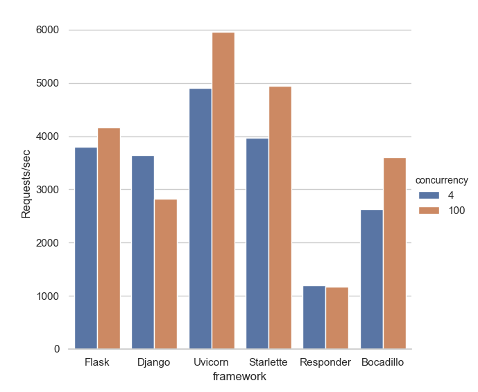

# Benchmarks

This repo provides a benchmark for various Python web frameworks against [Bocadillo].

## Disclaimer

A few things to keep in mind:

- This benchmark was created to get a sense for how Bocadillo compares in terms of performance. Ideally, you should run this on your machine, compare with other benchmarks, or — even better — do your own benchmark.
- Benchmarking is hard, because frameworks all have special ways in which they can be tweaked to optimize their performance. We're trying our best to configure all frameworks correctly, but it cannot be perfect. Consider [opening an issue](https://github.com/bocadilloproject/benchmarks/issues/new) if you want to help.
- There are many more aspects to consider outside performance when choosing a framework: ease of use, community, documentation, features, etc.
- Async frameworks naturally do better in high-concurrency settings. We have included both low, medium and high concurrency in this benchmark to give every framework a chance to shine.

## Running the benchmark

1. Install [Docker]
2. Clone the repo
3. Build the image: `docker build . -t bocadillo-benchmarks`
4. Run the container:

```bash
docker run -v `pwd`/results:/usr/src/results bocadillo-benchmarks
```

The benchmark can be configured via `config.json`.

## Results

Updated: Dec 23, 2018

### Configuration

Python version: 3.6

Machine:

- Macbook Pro (mid-2012)
- 2.5GHz Intel Core i5 (4 cores)

[wrk] test cases (low to medium concurrency, one thread per client):

| Parameter | Case 1 | Case 2 |
|:---:|:---:|:---:|
| Concurrency | 4 | 100 |
| Threads | 4 | 100 |
| Duration (s) | 15 | 15 |
| Warm up / cool down (s) | 5 | 5 |

Number of rounds ("best of" policy): 3.

Web servers:

- ASGI frameworks run with Gunicorn (19.9.0) + Uvicorn (0.3.20)
- WSGI run with Gunicorn (19.9.0) + Meinheld (0.6.1).

Versions used:

- Flask: 1.0.2
- Django: 2.1.4
- Uvicorn: 0.3.20
- Starlette: 0.9.9
- Responder: 1.1.2
- Bocadillo: 0.7.0

### Tests

#### Hello, World!

Test how fast the framework can provide a static response.

The server is called on `"/"` and should answer with a plaintext `"Hello, World!"` response.



[Docker]: https://docs.docker.com/install/
[Bocadillo]: https://github.com/bocadilloproject/bocadillo
[wrk]: https://github.com/wg/wrk
